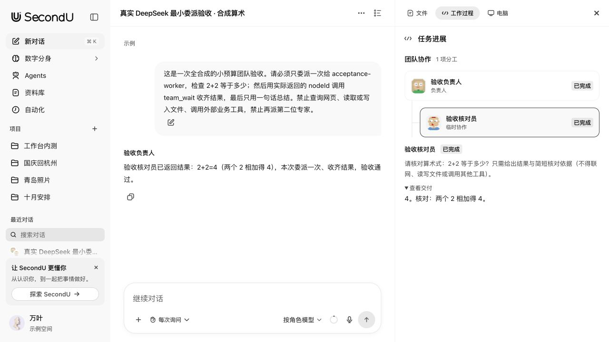
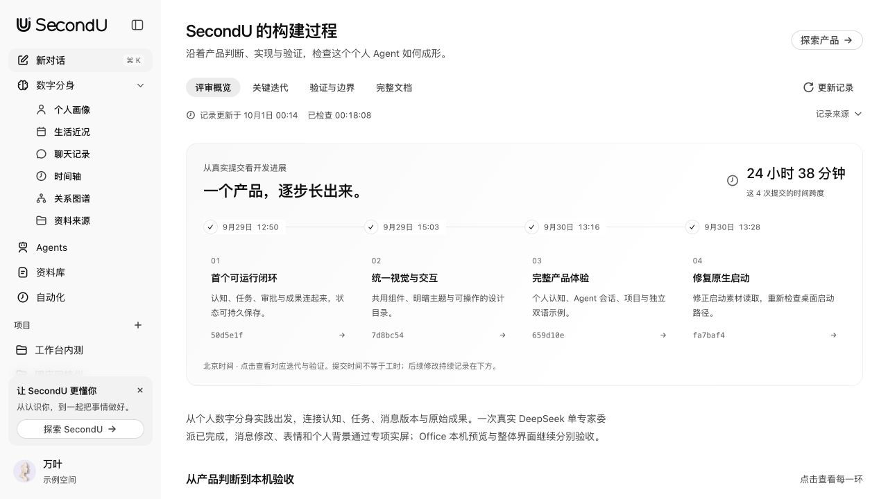
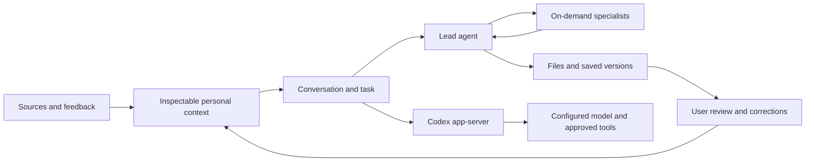

<p align="center"></p>

# SecondU

**SecondU is an agent product built around a personal digital twin. It continuously develops an understanding of a person’s background, experiences, preferences, goals, relationships and real circumstances, carries that understanding across tasks, applications and devices, proactively helps with work and everyday life, and supports collaboration, social interaction and professional services. Specialist agents, tools and execution environments participate as needed, within the user’s authorization.**

Three priorities express the product’s value:

- Reduce repeated input of personal background and judgments already made.
- Let complete multimodal context flow continuously across devices and situations.
- Distribute authorized, appropriately de-identified personal expertise to support agent-to-agent collaboration, social interaction and transactions.

These priorities do not limit the complete product scope. The [product definition](docs/PRODUCT.md) describes that direction; the runnable prototype’s implementation, actual acceptance and future plans are recorded separately. The complete vision is not a statement that every capability has shipped.

[中文](README.zh-CN.md) · [Quick start](QUICKSTART.md) · [Product walkthrough](docs/PROTOTYPE.md) · [Roadmap](docs/ROADMAP.md) · [Website](https://yunyueli.github.io/SecondU/) · [Development record](docs/DEVELOPMENT.md)

> **Runnable prototype.** The source includes fictional examples and locally testable workflows. It is not a production service or a promise that every provider, remote computer or external account has been verified. Website publication and downloadable releases have their own deployment status.


*The fictional example space. A visible model name is a configuration choice, not a live execution claim.*

## Start with the example

Use Node.js **22.18 or newer**; CI targets Node 22 on Linux and macOS. The runtime minimum is 22.13, but the tests import TypeScript directly and need type stripping enabled on older Node releases.

```sh
git clone https://github.com/YunyueLi/SecondU.git
cd SecondU
npm ci
npm run build
npm start
```

Open [localhost:58645](http://127.0.0.1:58645) and choose an example space. No model key is needed to browse it. Chinese and English examples have separately authored fictional people, relationships and projects. Your personal space is stored separately.

The prebuilt macOS bundle targets **Apple Silicon (arm64), macOS 13+**, and includes its Node runtime. Node.js and npm are needed only when running or building from source. Release assets are listed on the [Releases page](https://github.com/YunyueLi/SecondU/releases).

For an Electron window, run `npm run desktop` after building. The Electron 44 desktop requires macOS 13 or newer. macOS packaging is available through `npm run desktop:package`; it produces a locally signed `out/SecondU.app`, without Apple notarization. See [platform requirements and setup](QUICKSTART.md).

## What you can explore

| Area | What the product exposes |
| --- | --- |
| Personal context | Sources, conversations, a life timeline, relationships, goals and constraints. Confirmed facts, inferences and pending corrections stay distinct. |
| Conversations | Persistent tasks, quoted replies, reactions and message revision branches. Editing a sent question preserves the original conversation. |
| Agent teams | Reusable specialist roles, a designated lead and on-demand workers. The execution tree records dispatched work and its state separately from the member list. |
| Deliverables | Markdown, syntax-highlighted code, CSV/TSV, static HTML/SVG, images and PDF previews. DOCX/XLSX/PPTX use optional local LibreOffice conversion; original bytes and saved versions remain downloadable. |
| Local work | Project workspaces, model connections, tool approvals and schedules while the local service is running. |
| Review | An in-app component catalogue, onboarding demonstrations and an updateable development timeline linked to the underlying records. |

A useful first review: inspect the example person's context, open an existing task, compare two artifact versions, then inspect a team's members and execution tree. The [walkthrough](docs/PROTOTYPE.md) gives a concrete path and a small task for testing real execution.

<details>
<summary>See a team run and the review workspace</summary>



A real minimal team run using a synthetic arithmetic task: one lead, one checking specialist and persisted results. This demonstrates that narrow execution path, not general team performance.



The development reader links actual build records and their verification boundaries.

</details>

## How it fits together



React and the official **OpenAI Apps SDK UI** form the interface. A loopback Node service owns SQLite records, task workspaces and revision history. The installed **Codex CLI app-server** supplies the execution harness. SecondU owns the personal-context assembly, task lifecycle, team orchestration and file experience. [Architecture and evidence](docs/HARNESS.md) · [API](docs/API.md)

## Real execution and current limits

Browsing examples does not invoke a model. Real tasks require a local Codex CLI and a model connection configured with your own credentials in personal space. Missing configuration remains visible; the product does not substitute a simulated answer. Provider presets are configuration shortcuts, not compatibility certifications.

The current evidence includes a small real DeepSeek team run with one delegated specialist; its scope and limitations are recorded in the [prototype notes](docs/PROTOTYPE.md). Automated tests use synthetic data and local protocol fixtures. Those tests do not measure reasoning quality or certify every provider.

- Scheduled work needs the local service to stay online. There is no cloud wakeup while the computer sleeps.
- Remote-computer transport and persistence have local integration tests; a user's real SSH host still needs independent acceptance.
- Office previews are read-only local conversions and need LibreOffice. HTML/SVG previews disable scripts and external resources; arbitrary TSX is not executed as a preview.
- Phone, glasses, marketplace, Dating and some communication/resource surfaces are labelled development examples. They do not establish device synchronization, live calling, payment or external-account connectivity.
- Native acceptance currently targets macOS. Linux CI covers source build and local tests; Windows and signed distribution are not claimed as verified.

## Data and permissions

Development data lives in ignored `.hither/`; the desktop application retains the compatibility directory `~/Library/Application Support/Hither/`. `HITHER_DATA_DIR` selects another location. The desktop reuses a backend only when its data-space identity **and runtime build fingerprint** match.

The API listens on `127.0.0.1` and rejects cross-site writes. Credentials are saved in a separate local file with restricted permissions; this is **not OS keychain encryption**. Selected context and bounded source excerpts are sent to the model provider when you run a real task. External connectors and remote computers have their own explicit data paths. Read [Security](SECURITY.md) before importing sensitive material or exposing a local service.

The repository and its example fixtures must contain no private digital-twin records, credentials or personal runtime logs. The old **Hither** name remains in internal IDs, environment variables and data paths to preserve existing local state. [Brand compatibility](docs/BRANDING.md)

## Develop and contribute

```sh
# In separate terminals:
npm run server
npm run dev

# Verification:
npm test
npm run build
```

The development UI runs at [localhost:58644](http://127.0.0.1:58644) and proxies to port 58645. [Contributing](CONTRIBUTING.md) explains ownership, visual review and regression expectations. [Testing](docs/TESTING.md) distinguishes fixture tests, installed-runtime checks, provider calls and browser acceptance. CI never needs a model API key.

| Read next | Purpose |
| --- | --- |
| [Product walkthrough](docs/PROTOTYPE.md) | Product thesis, review route, verified scope |
| [Development](docs/DEVELOPMENT.md) / [Iteration](docs/ITERATION.md) | Decisions, corrections and evidence over time |
| [Design](docs/DESIGN.md) / [Research](docs/RESEARCH.md) | Shared visual language and adopted references |
| [Harness](docs/HARNESS.md) / [API](docs/API.md) | Implementation and state contracts |
| [Changelog](CHANGELOG.md) | User-visible changes; unreleased work stays labelled |
| [Security](SECURITY.md) / [Third-party notices](THIRD_PARTY_NOTICES.md) | Reporting, data boundaries and attribution |

## License

Project code is [MIT licensed](LICENSE). Third-party code, avatar artwork, brand marks and fonts retain their own licenses; see [Third-party notices](THIRD_PARTY_NOTICES.md). SecondU is independent of OpenAI, model providers and the referenced projects.
