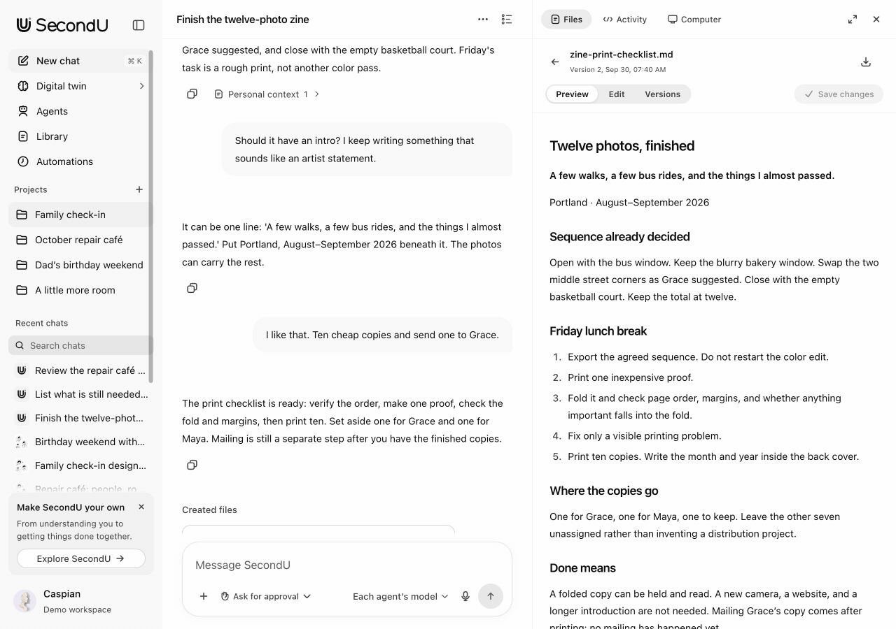
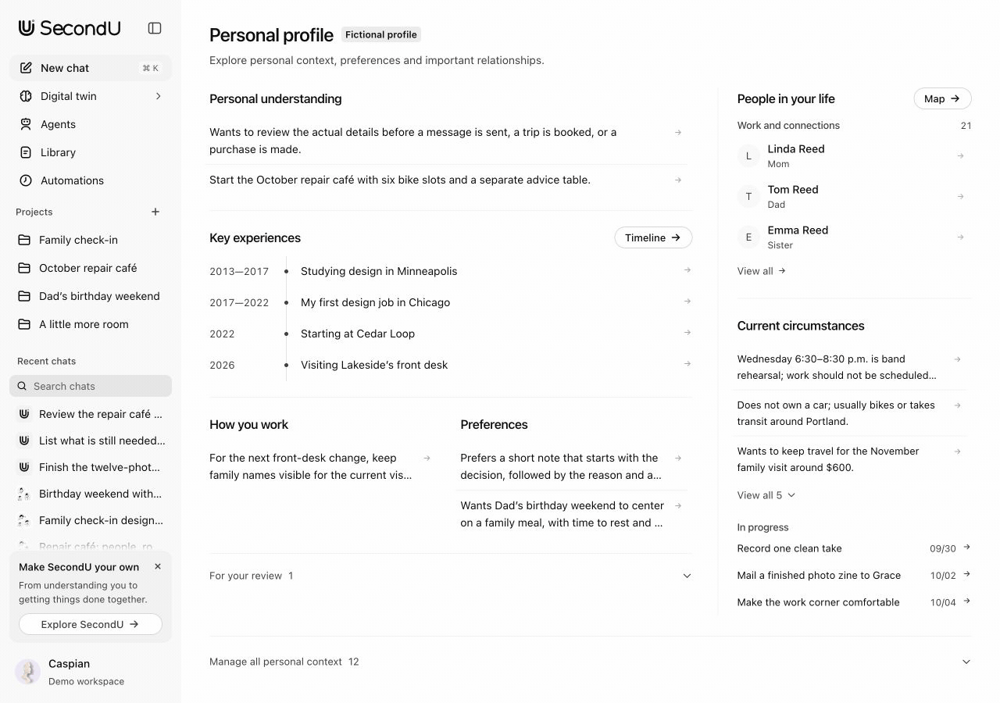
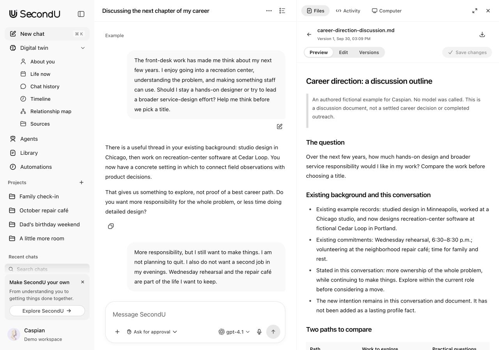
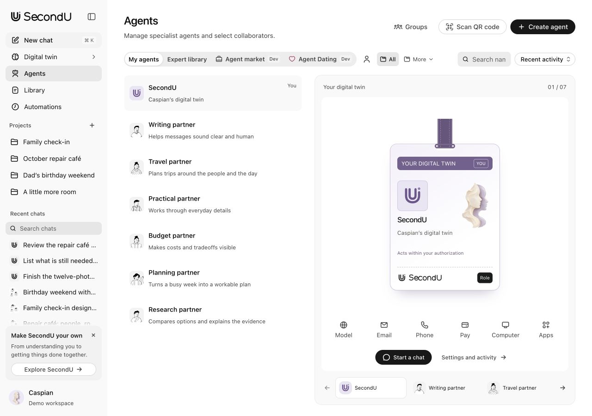

<p align="center">
  <a href="https://yunyueli.github.io/SecondU/?lang=en"></a>
</p>
<h1 align="center">SecondU</h1>
<p align="center"><strong>Your digital twin.</strong><br>From understanding to action.</p>
<p align="center">An open-source agent product built around a personal digital twin.</p>
<p align="center">
  <a href="https://yunyueli.github.io/SecondU/product/embed.html?space=demo-us-v1&lang=en#example-chat"><strong>Try SecondU</strong></a>&nbsp;&nbsp;&nbsp;
  <a href="https://github.com/YunyueLi/SecondU/releases/latest"><strong>Download for macOS</strong></a>&nbsp;&nbsp;&nbsp;
  <a href="QUICKSTART.md">Quick start</a>&nbsp;&nbsp;&nbsp;
  <a href="README.zh-CN.md">简体中文</a>
</p>
<p align="center">
  <a href="https://github.com/YunyueLi/SecondU/actions/workflows/ci.yml"></a>
</p>

<p align="center">
  <a href="https://yunyueli.github.io/SecondU/product/embed.html?space=demo-us-v1&lang=en#example-chat">
    <picture>
      <source media="(prefers-reduced-motion: reduce) and (prefers-color-scheme: dark)" srcset="docs/readme-assets/task-workspace-en-dark.jpg">
      <source media="(prefers-reduced-motion: reduce)" srcset="docs/readme-assets/task-workspace-en.jpg">
      <source media="(prefers-color-scheme: dark)" srcset="docs/readme-assets/task-workspace-en-dark.gif">
      
    </picture>
  </a>
</p>

<p align="center"><sub>Actual application states with fictional example data. <a href="https://yunyueli.github.io/SecondU/product/embed.html?space=demo-us-v1&lang=en#example-chat">Try the app</a> without an account or model key, or visit the <a href="https://yunyueli.github.io/SecondU/?lang=en">product website</a>.</sub></p>

## Understanding that carries forward

**SecondU is an open-source agent product built around a personal digital twin.**

SecondU develops an understanding of your background, experiences, values, preferences, relationships and long-term goals, and carries it across tasks, situations and devices. It connects scattered multimodal information, brings in experts and tools, and turns ideas into action, collaboration, social connections and professional services.

That product direction has three priorities:

- **Explain less, carry more forward.** Keep background and decisions with inspectable sources and correctable interpretations.
- **Keep context connected.** Carry multimodal materials, tasks and results across devices.
- **Share expertise on your terms.** Authorize a limited professional twin for collaboration, social connections and A2A services.

The **runnable desktop prototype** establishes this foundation. Cross-device continuity and the broader service network remain development directions. [Vision and roadmap](docs/ROADMAP.md)

## From personal context to useful work

### Understand the person behind the task

Bring in an existing summary, review and correct its entries, then carry confirmed context into an editable task draft that you choose when to send. Your profile, timeline, relationships and sources make that understanding inspectable. For choices about a home, education, work or relationships, discuss facts, trade-offs and uncertainty in light of your experiences, values and long-term goals. The decision remains yours. [Follow the five-minute walkthrough](docs/PROTOTYPE.md#五分钟体验主线), or inspect the [synthetic context comparison](docs/CONTEXT-BENCHMARK.md).

<p><a href="https://yunyueli.github.io/SecondU/product/embed.html?space=demo-us-v1&lang=en#self"><picture>
      <source media="(prefers-reduced-motion: reduce) and (prefers-color-scheme: dark)" srcset="docs/readme-assets/personal-context-en-dark.jpg">
      <source media="(prefers-reduced-motion: reduce)" srcset="docs/readme-assets/personal-context-en.jpg">
      <source media="(prefers-color-scheme: dark)" srcset="docs/readme-assets/personal-context-en-dark.gif">
      
    </picture></a></p>

### Think through an important choice

[Open the career discussion example](https://yunyueli.github.io/SecondU/product/embed.html?space=demo-us-v1&lang=en#example-decision) to see Caspian compare possible directions in light of his experience, working preferences and life outside work. Four exchanges and an editable outline live in the real task workspace. This is an authored fictional example: no model was called, no career preference became a profile fact, and no outreach or application was sent.

<p><a href="https://yunyueli.github.io/SecondU/product/embed.html?space=demo-us-v1&lang=en#example-decision"><picture>
      <source media="(prefers-color-scheme: dark)" srcset="docs/readme-assets/decision-support-en-dark.jpg">
      
    </picture></a></p>

### Bring the right expertise and tools together

Talk to a specialist or form a team with a lead. Follow delegated work, status and results. Project directories, model connections and approvals define the working environment.

<p><a href="https://yunyueli.github.io/SecondU/product/embed.html?space=demo-us-v1&lang=en#agents"><picture>
      <source media="(prefers-color-scheme: dark)" srcset="docs/readme-assets/specialists-en-dark.jpg">
      
    </picture></a></p>

### Keep working with the result

Edit files beside the conversation, save versions and revisit earlier content. Revising a sent question creates a new branch; the original discussion and feedback remain available.

| Also included | Current capability |
| --- | --- |
| Files and previews | Markdown, code, tables, static HTML/SVG, images and PDF. Office originals are preserved, with optional local LibreOffice PDF previews. |
| Messaging | OpenClaw setup for 13 channels. Slack/Discord history import and confirmed sending, with explicit account and conversation scope. |
| Context for other AI apps | Versioned context exports and explicitly authorized read-only MCP snapshots. [Interoperability](docs/INTEROPERABILITY.md) |
| Projects and routines | Project materials, directories, goals and locally scheduled tasks. |
| Limited capability sharing | Local text delegation and an A2A subset, with scoped authorization, approval and revocation. [Scope](docs/DELEGATION.md) |
| A workspace you can inspect | Bilingual examples, themes, a component catalogue and an updateable development timeline. |

## Get started

| Start here | What to expect |
| --- | --- |
| **[Try it in your browser](https://yunyueli.github.io/SecondU/product/embed.html?space=demo-us-v1&lang=en#example-chat)** | The real app with fictional bilingual examples and page-local summary import. Imported content and edits reset on refresh; no model execution or account connection. |
| **[Download the desktop app](https://github.com/YunyueLi/SecondU/releases/latest)** | Apple Silicon Mac, macOS 13+. Includes Node. Ad-hoc signed, not Apple-notarized. |
| **Run from source** | Node.js 22.18+ and npm. Use the commands below, then open [localhost:58645](http://127.0.0.1:58645). |

```sh
git clone https://github.com/YunyueLi/SecondU.git
cd SecondU
npm ci
npm run build
npm start
```

Choose an example space to explore without credentials. To run real tasks, enter personal space, install **Codex CLI** separately and configure your own model connection. [Setup and troubleshooting](QUICKSTART.md)

## Your data, your permissions

Records and file history stay local, separate from examples. You choose the model and task context. **Cloud models receive selected context and bounded source excerpts.**

The API is loopback-only; credentials are stored separately with restricted permissions. Tools and sharing have explicit scopes. [Security](SECURITY.md) and [backup](QUICKSTART.md#data-paths-and-environment)

## Where the product is going

The [12-direction roadmap](docs/ROADMAP.md) describes current foundations, next steps and the conditions for accepting each capability.

| Direction | Areas |
| --- | --- |
| A lasting personal foundation | Understanding the person; work and life assistance; proactive, ongoing responsibilities |
| Work that can continue | Specialist teams; projects and deliverables; local and remote execution |
| Context beyond one screen | Communication and real-world resources; multimodal continuity across devices; authorized expertise distribution |
| A network built around people | A2A collaboration and service transactions; social and relationship discovery; continuously improving personal assets |

**Development status:** the desktop supports context, tasks, teams and files. Automation needs the local service online. Cross-device, marketplace and Dating experiences are **Dev**; synchronization, calls, payments and matching remain planned. macOS arm64 has native delivery; Linux CI covers source builds and tests. [Verified scope](docs/PROTOTYPE.md#当前证据与限制)

## How it works

[](https://yunyueli.github.io/SecondU/architecture/understanding-loop-en.html)

[Explore the understanding loop](https://yunyueli.github.io/SecondU/architecture/understanding-loop-en.html)

[Explore the execution architecture](https://yunyueli.github.io/SecondU/architecture/harness-en.html)

**React and official OpenAI Apps SDK UI** power the interface; **Node.js and SQLite** persist state. **Codex CLI app-server** supplies execution. SecondU adds context, task and team orchestration, permissions and versioned files.

[Harness architecture](docs/HARNESS.md) and [API reference](docs/API.md) explain the execution and persistence contracts.

## Build with us

Run `npm run server` and `npm run dev` in separate terminals. Check with `npm test` and `npm run build`; verify interface changes on the actual screen.

Contribute to context quality, recovery, files, accessibility or integrations. Read [Contributing](CONTRIBUTING.md) and use fictional data in reports.

<details>
<summary><strong>Source map and documentation</strong></summary>

| Explore the source | Responsibility |
| --- | --- |
| [`src/`](src/) | Product interface and shared visual system |
| [`server/`](server/) and [`shared/`](shared/) | Storage, runtime orchestration, APIs and contracts |
| [`desktop/`](desktop/) | Electron application and macOS packaging |
| [`website/`](website/) | Product website and isolated interactive example |
| [`tests/`](tests/) | State, permissions, protocol and regression checks |

| Read next | Purpose |
| --- | --- |
| [Product walkthrough](docs/PROTOTYPE.md) | Follow a complete example and review current scope |
| [Design](docs/DESIGN.md) and [Research](docs/RESEARCH.md) | Visual language and design decisions |
| [Testing](docs/TESTING.md) and [Development](docs/DEVELOPMENT.md) | Verification guidance and implementation evidence |
| [Changelog](CHANGELOG.md) and [Iterations](docs/ITERATION.md) | User-visible changes and decisions over time |

</details>

## License

Project code is [MIT licensed](LICENSE); third-party assets retain their [own licenses](THIRD_PARTY_NOTICES.md). SecondU is independent of OpenAI and model providers. **Hither** remains in legacy identifiers and data paths.
