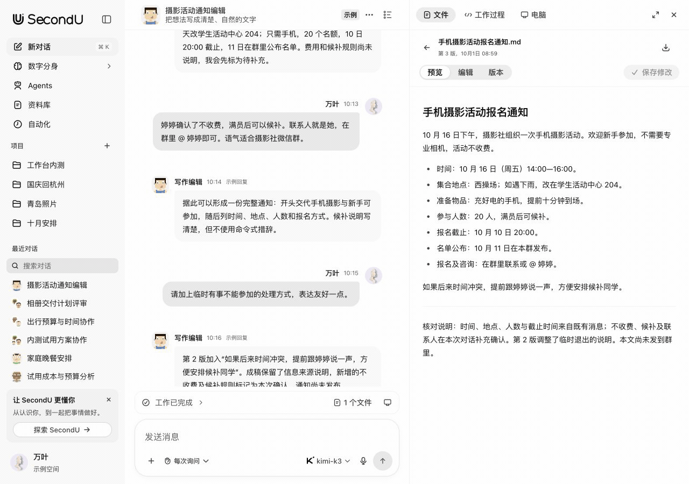
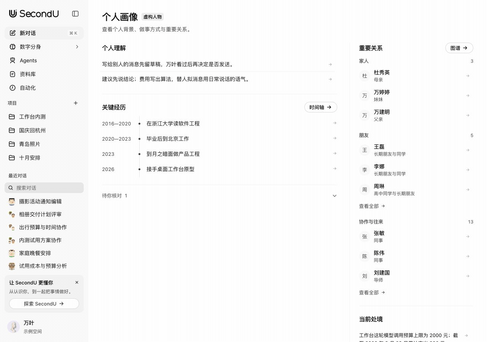
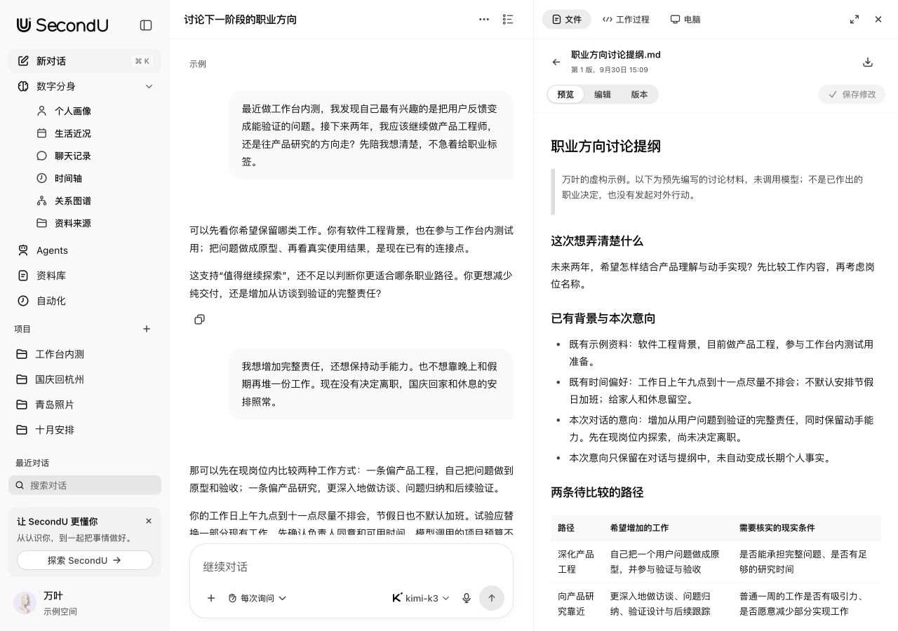
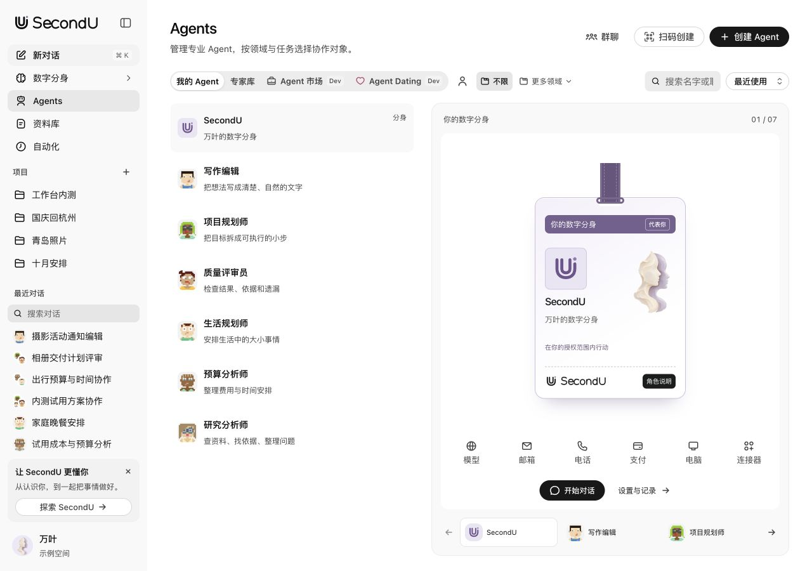

<p align="center">
  <a href="https://yunyueli.github.io/SecondU/?lang=zh"></a>
</p>
<h1 align="center">SecondU</h1>
<p align="center"><strong>你的数字分身。</strong><br>从懂你，到为你行动。</p>
<p align="center">以个人数字分身为核心的开源智能体产品。</p>
<p align="center">
  <a href="https://yunyueli.github.io/SecondU/product/embed.html?space=demo-cn-v1&lang=zh#example-chat"><strong>在线体验</strong></a>&nbsp;&nbsp;&nbsp;
  <a href="https://github.com/YunyueLi/SecondU/releases/latest"><strong>下载 macOS 版</strong></a>&nbsp;&nbsp;&nbsp;
  <a href="QUICKSTART.md">快速开始</a>&nbsp;&nbsp;&nbsp;
  <a href="https://yunyueli.github.io/SecondU/benchmark/?lang=zh">Benchmark</a>&nbsp;&nbsp;&nbsp;
  <a href="README.md">English</a>
</p>
<p align="center">
  <a href="https://github.com/YunyueLi/SecondU/actions/workflows/ci.yml"></a>
</p>

<p align="center">
  <a href="https://yunyueli.github.io/SecondU/product/embed.html?space=demo-cn-v1&lang=zh#example-chat">
    <picture>
      <source media="(prefers-reduced-motion: reduce) and (prefers-color-scheme: dark)" srcset="docs/readme-assets/task-workspace-zh-dark.jpg">
      <source media="(prefers-reduced-motion: reduce)" srcset="docs/readme-assets/task-workspace-zh.jpg">
      <source media="(prefers-color-scheme: dark)" srcset="docs/readme-assets/task-workspace-zh-dark.gif">
      
    </picture>
  </a>
</p>

<p align="center"><sub>截图来自实际产品界面，内容为虚构示例。无需账号或模型密钥，即可<a href="https://yunyueli.github.io/SecondU/product/embed.html?space=demo-cn-v1&lang=zh#example-chat">直接体验产品</a>，或浏览<a href="https://yunyueli.github.io/SecondU/?lang=zh">官网</a>。</sub></p>

## 让理解延续到下一件事

**SecondU 是以个人数字分身为核心的开源智能体产品。**

SecondU 持续理解你的背景、经历、价值观、偏好、关系和长期目标，在不同任务、场景和设备之间延续这些理解。组织归拢零散多模态信息，调度合适的专家与工具，主动处理任意想法与事务，并支持协作、社交和专业服务。

这条产品方向有三个重点：

- **少重复解释。** 已经说明的背景与判断可以持续维护，重要理解有来源，也能够纠正。
- **让上下文一起流转。** 多模态资料、任务与成果，在设备和场景之间接续。
- **让专业能力走出去。** 在本人授权范围内，由受限专业分身参与协作、社交与 A2A 服务交易。

当前的**可运行桌面原型**建立这套体验的基础。跨设备连续体验和完整服务网络仍在开发路线中。[产品定位](docs/PRODUCT.md)与[完整路线](docs/ROADMAP.md)分别说明愿景和当前进度。

## 从个人理解到具体成果

### 理解提出任务的人

从个人画像、经历、关系与原始资料开始。导入自己整理过的 Markdown 或 JSON 摘要，逐条核对候选，再确认哪些内容进入个人理解。最后带入可编辑任务草稿，由本人决定是否发送。为任务选择背景，查看实际使用的内容，并通过纠正改进后续任务。面对购房定居、学校、职业或亲密关系等重要选择，结合经历、价值观与长期目标，梳理事实、比较得失和不确定性，提供可讨论的参考，由本人决定。[查看五分钟体验主线](docs/PROTOTYPE.md#五分钟体验主线)，或核对[合成材料的上下文对照](docs/CONTEXT-BENCHMARK.md)。

<p>
  <a href="https://yunyueli.github.io/SecondU/product/embed.html?space=demo-cn-v1&lang=zh#self">
    <picture>
      <source media="(prefers-reduced-motion: reduce) and (prefers-color-scheme: dark)" srcset="docs/readme-assets/personal-context-zh-dark.jpg">
      <source media="(prefers-reduced-motion: reduce)" srcset="docs/readme-assets/personal-context-zh.jpg">
      <source media="(prefers-color-scheme: dark)" srcset="docs/readme-assets/personal-context-zh-dark.gif">
      
    </picture>
  </a>
</p>

### 把重要选择讨论清楚

[打开职业方向讨论示例](https://yunyueli.github.io/SecondU/product/embed.html?space=demo-cn-v1&lang=zh#example-decision)，查看万叶如何结合已有经历、工作方式和生活安排比较下一阶段的方向。四轮问答与讨论提纲都在真实任务工作区，提纲可以继续编辑。内容是预先编写的虚构示例，未调用模型，讨论意向未写入个人事实，也没有约人或投递。

<p><a href="https://yunyueli.github.io/SecondU/product/embed.html?space=demo-cn-v1&lang=zh#example-decision"><picture>
      <source media="(prefers-color-scheme: dark)" srcset="docs/readme-assets/decision-support-zh-dark.jpg">
      
    </picture></a></p>

### 组织合适的专家与工具

创建专业 Agent，单独对话，或围绕一件事组建团队。指定负责人，按需委派专家，查看每项工作的执行者、状态和结果。项目目录、模型连接与操作审批共同限定实际工作环境。

<p><a href="https://yunyueli.github.io/SecondU/product/embed.html?space=demo-cn-v1&lang=zh#agents"><picture>
      <source media="(prefers-color-scheme: dark)" srcset="docs/readme-assets/specialists-zh-dark.jpg">
      
    </picture></a></p>

### 继续使用和修改成果

在对话旁查看文件，编辑支持的文本格式，保存新版本，再回看之前的内容。修改已发送的问题会建立新会话分支，保留原始讨论。反馈和修正可以继续查阅与确认。

| 其他能力 | 当前范围 |
| --- | --- |
| 文件与预览 | Markdown、代码、CSV/TSV、静态 HTML/SVG、图片和 PDF。DOCX/XLSX/PPTX 保留原件，可通过本机 LibreOffice 转为只读 PDF 预览。 |
| 通信接入 | 内置 OpenClaw 连接向导，限定账号与会话，先预览再导入，发送逐条确认。13 个渠道提供授权配置，Slack／Discord 支持记录读取，其余已列渠道支持确认后发送。 |
| 向其他 AI 提供上下文 | 导出带版本的认知封装，或明确授权只读 MCP 快照，仅开放所选已确认条目。[互操作说明](docs/INTEROPERABILITY.md) |
| 项目与日常安排 | 项目资料、工作目录、目标，以及本机服务在线时运行的定时任务。 |
| 受限能力分享 | 本机文本委托与 A2A 协议子集，可选择材料，按接收者授权，审批和撤回。[具体范围](docs/DELEGATION.md) |
| 可检查的产品界面 | 中英文示例、明暗模式、主题装饰、实际组件目录，以及能够更新的构建时间线。 |

## 个人上下文评测

[**打开交互式 Benchmark**](https://yunyueli.github.io/SecondU/benchmark/?lang=zh)：**24 个合成场景、六个维度、三种上下文条件、各重复两次；计划调用 144 次，实际返回 143 次。** 可逐题检查两个轮次、实际输入、模型原文、引用来源与失败原因。[评测方法与复现](docs/CONTEXT-BENCHMARK.md) · [冻结计划与完整证据](benchmarks/results/2026-10-01-v2/)

主要对照使用同一模型和 8,000 字符上下文上限：原始资料采用 BM25 检索，SecondU 采用产品实际的确认、纠正和上下文选择流程。

| 预设检查项 | 原始资料检索 | SecondU 上下文 |
| --- | ---: | ---: |
| 两次均通过的场景 | 24 / 24 | 21 / 24 |
| 决策或澄清符合预期的调用 | 48 / 48 | 43 / 48 |
| 硬约束满足，限适用场景 | 36 / 36 | 32 / 36 |
| 必要来源覆盖，限适用场景 | 40 / 40 | 36 / 40 |

**这轮暴露的问题：**SecondU 在 H03、H04 未取回必需来源，四次回复都作了合理澄清，但仍未完成预设决策。R04 的第二次 SecondU 调用在 180 秒后超时，未重试。这些记录均保留在分母中；传输失败不能归因于检索质量。

无个人上下文单独按可见信息校准：**47 / 48** 次符合预期，另一次返回截断 JSON，原文未修补。本轮仅使用单一模型和作者确认的合成材料，尚未证明普遍的回答质量、速度或 token 效率优势，也未检验自动事实提取与真实用户的长期效果。[12 次历史基线](benchmarks/results/2026-10-01/)与 [12 次先导运行](benchmarks/results/2026-10-01-v2/pilot/)均独立保留，不计入正式结果。

## 开始使用

| 方式 | 可以做什么 |
| --- | --- |
| **[在线体验](https://yunyueli.github.io/SecondU/product/embed.html?space=demo-cn-v1&lang=zh#example-chat)** | 实际应用界面，内置中英文虚构示例，可在本页导入摘要。导入内容与修改刷新后清空；不执行模型任务或连接外部账号。 |
| **[下载桌面版](https://github.com/YunyueLi/SecondU/releases/latest)** | 适用于 Apple Silicon Mac，要求 macOS 13+，已内置 Node 运行时。原型采用本机临时签名，尚未通过 Apple 公证。 |
| **从源码运行** | 需要 Node.js 22.18+ 和 npm。执行下方命令后，打开 [localhost:58645](http://127.0.0.1:58645)。 |

```sh
git clone https://github.com/YunyueLi/SecondU.git
cd SecondU
npm ci
npm run build
npm start
```

进入示例空间即可无密钥浏览。真实任务需要进入个人空间，另行安装 **Codex CLI**，并配置自己的模型连接。[安装与排错](QUICKSTART.md)

## 资料与权限由你掌握

个人资料与文件历史保存在本机，与虚构示例分开。模型连接和任务使用的背景由你选择。**使用云模型时，所选上下文与有限来源摘录会发送给对应提供方。**

API 只监听回环地址；凭据保存于限制权限的独立本机文件。工具审批与对外分享分别设定范围。导入敏感材料前请阅读[安全说明](SECURITY.md)，资料位置与备份方式见[运行说明](QUICKSTART.md#data-paths-and-environment)。

## 产品将走向哪里


[十二个方向的完整路线](docs/ROADMAP.md)列出当前基础、下一步工作与各项能力的验收条件。

| 方向 | 包含的领域 |
| --- | --- |
| 持续维护的个人基础 | 理解本人；工作与生活助理；主动帮助与长期职责 |
| 可以接续的工作 | 专家团队；项目与成果；本机和远程执行 |
| 延伸到不同场景的上下文 | 通信与现实资源；跨设备多模态体验；获准的专业能力分发 |
| 围绕人的协作网络 | A2A 协作与服务交易；社交和恋爱匹配；持续更新的个人资产 |

**开发状态：**桌面版已支持个人认知、任务、团队与成果工作区。本机自动化需要服务在线；远程主机按实际环境验证。跨设备、服务市场与 Dating 以 **Dev** 标识开发中的体验；设备同步、通话、支付和真实撮合仍在规划中。原生桌面面向 macOS arm64，Linux 持续集成覆盖源码构建与本地测试。[已验证范围](docs/PROTOTYPE.md#当前证据与限制)

## 实现结构

[](https://yunyueli.github.io/SecondU/architecture/understanding-loop-zh.html)

[查看可交互的理解反馈图](https://yunyueli.github.io/SecondU/architecture/understanding-loop-zh.html)

[查看完整执行架构](https://yunyueli.github.io/SecondU/architecture/harness-zh.html)

界面采用 **React 和官方 OpenAI Apps SDK UI**；本机 **Node.js 服务与 SQLite** 维护资料、任务状态和文件版本。执行底层复用 **Codex CLI app-server**，SecondU 实现个人上下文装配、持久任务、团队调度、权限与成果工作区。

[Harness 架构](docs/HARNESS.md)与 [API 文档](docs/API.md)说明执行、状态和持久化细节。

## 一起完善 SecondU

在两个终端分别运行 `npm run server` 和 `npm run dev`，打开 [localhost:58644](http://127.0.0.1:58644)。使用 `npm test` 和 `npm run build` 检查修改。CI 使用无密钥的本地测试；界面修改还需实际页面验收。

欢迎围绕具体工作流程贡献：个人理解质量、失败恢复、文件处理、无障碍体验或可以复现的集成问题。请先阅读[贡献规范](CONTRIBUTING.md)，报告问题时使用虚构资料。

<details>
<summary><strong>源码导航与开发文档</strong></summary>

| 源码入口 | 职责 |
| --- | --- |
| [`src/`](src/) | 产品界面与统一视觉体系 |
| [`server/`](server/) 与 [`shared/`](shared/) | 存储、运行编排、接口与类型契约 |
| [`desktop/`](desktop/) | Electron 应用与 macOS 打包 |
| [`website/`](website/) | 产品官网与隔离的交互示例 |
| [`tests/`](tests/) | 状态、权限、协议与回归检查 |

| 继续阅读 | 内容 |
| --- | --- |
| [产品体验路线](docs/PROTOTYPE.md) | 完整示例与当前实现范围 |
| [设计规范](docs/DESIGN.md)与[研究依据](docs/RESEARCH.md) | 视觉语言与产品取舍 |
| [测试说明](docs/TESTING.md)与[构建过程](docs/DEVELOPMENT.md) | 验证方式与实际实现记录 |
| [更新记录](CHANGELOG.md)与[逐项迭代](docs/ITERATION.md) | 用户可见变化与决策过程 |

</details>

## 开源许可

项目代码采用 [MIT](LICENSE)。第三方代码、插画、品牌标识与字体保留各自许可，详见[第三方说明](THIRD_PARTY_NOTICES.md)。SecondU 为独立项目，与 OpenAI 或模型提供方无官方从属关系。旧名称 **Hither** 保留在部分内部标识与资料路径中，用于兼容已有状态。

<p><sub><a href="https://yunyueli.github.io/SecondU/?lang=zh">移动鼠标，发现藏在首页的 2ndU。</a></sub></p>
