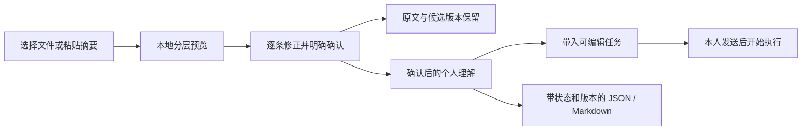

# 本地记忆导入与数字分身封装

本模块让用户从已经整理过的个人背景开始使用 SecondU。用户主动选择 `AGENTS.md`、`CLAUDE.md`、Markdown、文本或 JSON 文件，也可以粘贴另一款 AI 整理的摘要。解析、预览、选择和保存都在本机完成，不扫描磁盘、不连接外部账号、不调用模型。



## 状态与职责

- 文件中的说法只是待核对材料。输入 JSON 写着 `confirmed` 不构成确认。普通 `commit` 只创建 `candidate`；三步向导只有在本人按下「确认理解」后，才调用独立的 `review` 操作。项目中的指令、Markdown 链接和代码不会执行，也不会授予权限。
- 预览按标题、项目符号和段落确定性整理；不会假称理解了整份档案。代码块跳过，完整原文保留在本机来源里。一个完整 JSON 代码块可以作为结构化摘要读取。
- 向导中可以取消条目、修改表述和分类。明确确认时，一次事务保留原文、候选第 1 版和确认第 2 版；任一条目失效则整批回滚。之后仍可在个人画像中修订，沿用 `baseVersion` 冲突检查和不可覆盖的历史。
- 背景、偏好、目标、约束、价值、能力、既有决定和其他记忆保留独立 `layer`。其中目标是待确认的个人意向，不自动新建待办、执行任务或设置自动化。现有认知类型分别映射到 `identity`、`preference`、`decision`、`constraint`、`value`、`capability`；附加分层保存在导入索引中。
- 每个条目关联来源 SHA-256、Markdown 行号或 JSON Pointer。相同来源和位置产生稳定条目标识。重复导入不会覆盖已确认、已纠正或已替代的记录；同一次预览的重试必须使用同一选择集合。
- 常规任务只检索已确认认知。核对用途可按既有上下文协议显式包含未确认项，并保留状态。对于记忆导入来源，运行时只提供本轮所选条目的原文摘录，邻近未选条目不会随整份文件进入 prompt。

每份输入最多 256 KiB、200 条记忆；每条最多 2000 字符。临时预览有效期为 30 分钟，最多保留 20 份。原始文件和预览只存在于当前空间的本机数据库；不是公有仓库的 fixture。明显的私钥、常见 API token 格式会被拒绝，但这不代表自动发现了所有敏感信息，用户仍应先整理内容。

## 导入 JSON v1

这是 SecondU 的可移植摘要协议，不声称是其他厂商的原生记忆 schema。只读取以下结构或同名分组数组；不读取 Claude、OpenClaw、Hermes 的私有数据库或凭据。

```json
{
  "schema": "secondu.memory",
  "schemaVersion": 1,
  "entries": [
    {"layer": "preferences", "statement": "先给结论，再列需要我决定的事项。"},
    {"layer": "constraints", "statement": "周三晚上不安排会议。"}
  ]
}
```

以上两条仅为虚构的格式示例。允许的 `layer`：`facts`、`preferences`、`goals`、`constraints`、`values`、`capabilities`、`decisions`、`notes`。兼容分组形式，例如 `{"preferences":["一条偏好"]}`。JSON 自带的 evidence 留在原文件里，不自动认定为经过核实的外部证据。

导入界面提供一段可复制的提示词，请另一款 AI 只整理本人明确提供过的内容，不推测、不含凭据。用户自行复制与提交，SecondU 不向另一款 AI 代传资料。

## API

所有接口沿用本机请求与空间隔离：默认前缀为 `/api`，指定空间使用 `/api/spaces/:spaceId`。

| 接口 | 输入或输出 |
| --- | --- |
| `POST /imports/memory/preview` | `{filename, content}` → `{previewId, filename, sha256, format, candidates, warnings, expiresAt}` |
| `POST /imports/memory/commit` | `{previewId, candidateIds}` → `{sourceId, factIds, added, duplicates, alreadyImported}`；只保存候选 |
| `POST /imports/memory/review` | `{previewId, entries:[{id, statement, layer}], confirmed:true}` → 上述结果加 `facts`；原子保存经本人核对的确认版本 |
| `GET /digital-twin/export?format=json` | 当前认知条目的可移植 JSON；下载文件名 `secondu-digital-twin.json` |
| `GET /digital-twin/export?format=markdown` | 人类可读的当前认知、状态、版本和来源索引 |
| `POST /digital-twin/context` | `{prompt, contextRequest?: {domain, purpose, budgetChars}}` → 既有 `secondu.context.v1` 加 `packageRevision` |

`review` 只接受本次预览中的新条目，不覆盖已导入记录。幂等键绑定预览、所选 ID、正文和分类；相同请求重试返回当前事实版本，不重写后来的纠正。不同内容复用同一预览会返回 `409`，需要重新预览。

上下文接口复用 `personalContextFor`，不创建任务。`domain` 为 `auto/personal/project`，`purpose` 遵循现有认知上下文协议，字符预算为 4000–40000，默认 20000。它返回分层记录与来源标识，不把原始文件全文放进响应。实际任务继续走现有上下文选择和受限来源摘录。

导出封装：

```json
{
  "schema": "secondu.digital-twin",
  "schemaVersion": 1,
  "revision": "sha256-of-canonical-content",
  "exportedAt": "ISO-8601",
  "subject": {"name": "示例本人"},
  "entries": [
    {
      "id": "memory-fact-example",
      "layer": "preferences",
      "kind": "preference",
      "statement": "一条经用户核对的偏好",
      "status": "confirmed",
      "revision": 2,
      "updatedAt": "ISO-8601",
      "evidence": [{"sourceId": "source-example", "lineStart": 3, "lineEnd": 3, "excerpt": "来源中的对应条目"}]
    }
  ],
  "evidence": [{"id": "source-example", "title": "memory.md", "kind": "document", "sha256": "sha256-of-original"}]
}
```

封装的 `revision` 由内容决定，不因再次下载的时间变化；条目 `revision` 使用既有认知版本。当前封装范围是认知条目及其简短证据引用，保留所有确认状态。完整会话、人物关系、时间轴、成果历史仍使用已有 `/export` 备份，不混为本封装已覆盖。包不包含来源全文、模型连接、账号凭据或可执行配置。重新导入包仍需预览和本人确认，不能凭包内状态自动获得事实权威。

## 前端接入

`src/cognition/MemoryImport.tsx` 导出：

- `MemoryImportEntry({onRefresh, onPrepareTask?, compact?})`：导入入口与 JSON / Markdown 导出菜单。个人画像传入现有 `prepareTask`；设置入口导航至 `#self/import`，避免叠加弹层。
- `MemoryImport({onClose, onRefresh, onPrepareTask, onImported?})`：同一弹层中的带入资料、核对理解、用于任务三步。条目修正在原位完成。
- 首次引导的最后一步，以及没有认知和任务的个人首页，提供 `#self/import` 入口。首页提示可跳过，之后仍可从个人画像重新打开；不会自动打断已使用的工作区。

最后一步编辑任务正文，选择优先参考的已确认条目。点击「带入新对话」仅打开现有 composer，携带确认后的 factIds；用户仍可调整背景、模型和权限。只有本人点击发送才创建和运行真实任务。显式 factIds 是上下文选择的优先项，并非排除其他相关已确认背景的白名单。

类型位于 `shared/memory-import.ts`。官网的无网络内存适配器需要单独接入这些接口；不能以桌面 HTTP 检查代替官网能力验证。

## 验证与后续接入

`tests/memory-review.test.mjs` 另覆盖原子确认及修订、完整请求幂等、来源不可变、跨空间拒绝、失败回滚，以及新任务采用确认版本而不自动执行。

`tests/memory-import.test.mjs` 覆盖预览无事实写入、来源/行号保留、选择集合绑定、重复导入保护已有修订、候选隔离、本人确认后的上下文、确定性导出版本、JSON 往返、过期和畸形输入、重启可用预览，以及未选来源不进入 prompt。测试使用全新临时目录和虚构材料，不访问用户真实资料。

通信导入沿用 [COMMUNICATIONS.md](COMMUNICATIONS.md) 的指定账号／会话读取、预览、确认及版本绑定。新增内置向导支持固定版本 OpenClaw 的独立安装、13 个渠道的授权配置、WhatsApp 临时二维码、账号检查和目标范围选择。只有 Slack／Discord 已适配历史记录读取；其他渠道的发送入口不代表已经支持个人上下文同步。已有 OpenClaw 模式保持原配置与服务所有权。20 项模拟 CLI 和协议测试通过，真实账号与平台权限仍按渠道验收。官方依据见 [渠道 CLI](https://docs.openclaw.ai/cli/channels) 和 [固定版本 MIT 许可](https://github.com/openclaw/openclaw/blob/v2026.9.7/LICENSE)。

需要让其他 AI 客户端读取部分个人上下文时，使用 [只读 MCP 授权](INTEROPERABILITY.md)：本人选择已确认条目并审阅固定快照，授权默认关闭，逐次读取检查撤销状态。标准导出、外部读取授权和完整资料备份各有独立范围。
